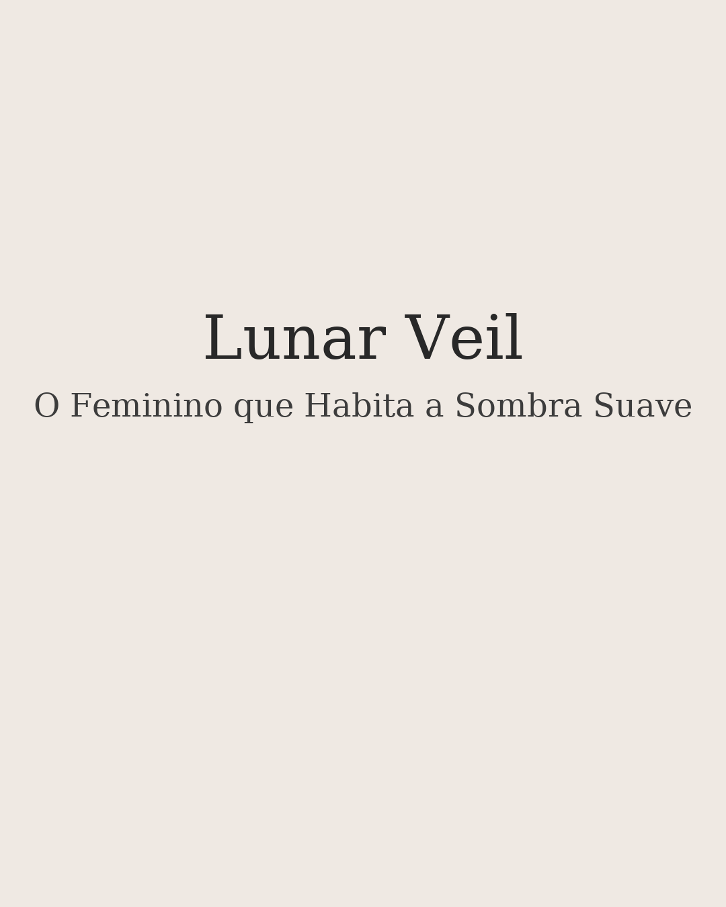

# 🌙 Lunar Veil — O Feminino que Habita a Sombra Suave

  

 Este projeto é uma contemplação visual sobre o feminino que habita a sombra suave.
 Não como ausência de luz, mas como um espaço íntimo de retorno a si.
 Um catálogo silencioso de força, delicadeza e presença interior.

## 📒 Descrição
**Lunar Veil** é um ensaio visual composto por 9 retratos em estética **Dark Feminine Suave / Etérea**.  
O projeto investiga a presença silenciosa do feminino que habita a sombra — não como ausência de luz, mas como **território de introspecção e renascimento**.

A narrativa é construída a partir de imagens e breves versos contemplativos, criando um percurso emocional lento, íntimo e ritualístico.

## 🤖 Tecnologias Utilizadas
- **Whisk — Google Labs (IA Generativa)**
- **Canva / PDF** para edição e montagem
- **GitHub** para documentação e portfólio
- **ChatGPT** para prompt

## 🧐 Processo de Criação
1. Definição da estética desejada: sombras suaves, atmosfera lunar e gestos silenciosos.
2. Geração das imagens utilizando IA, explorando:
   - delicadeza gótica
   - pele luminosa em tons frios
   - fundos nebulosos e difusos
3. Curadoria das imagens selecionadas com foco na **coerência atmosférica**.
4. Escrita de **poemas curtos** que ecoam a presença interior do feminino contemplativo.
5. Montagem final do catálogo visual em ordem narrativa crescente.

## 🚀 Resultado
O projeto final apresenta uma sequência visual **contemplativa e íntima**, onde cada imagem funciona como um espelho emocional e cada verso como respiração entre uma revelação e outra.

> “A sombra não é ausência de luz — é território de renascimento.”

## 📂 Estrutura do Repositório
/

  ├── images/ # Imagens individuais utilizadas no projeto

  ├── lunar-veil.pdf # Catálogo visual completo

  └── README.md # Documentação do projeto

## 💭 Reflexão
Criar com IA não é abdicar da autoria — é exercer **curadoria e intenção**.  
A força deste projeto está no **silêncio entre as imagens** — e na decisão de deixá-las falar.

---

**Projeto desenvolvido no contexto do Lab DIO — Natty or Not**  https://github.com/digitalinnovationone/lab-natty-or-not

Use a hashtag **#LabDIONattyOrNot** se compartilhar ✨
